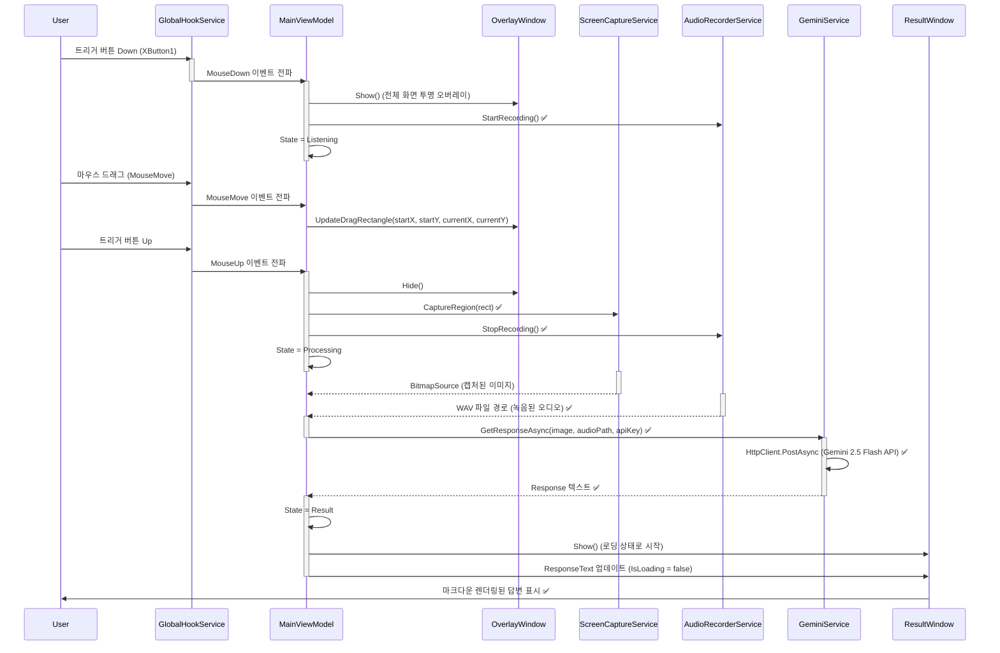
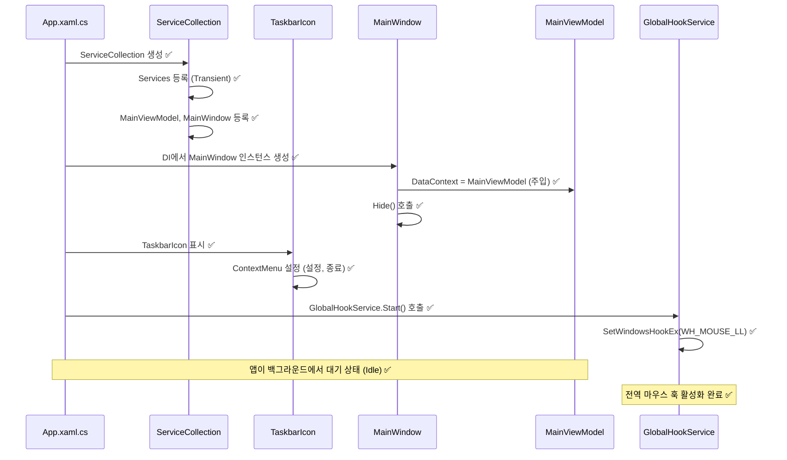
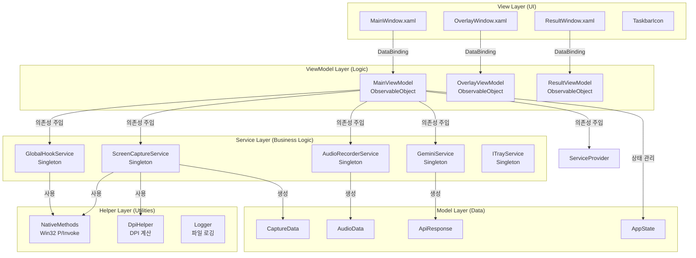
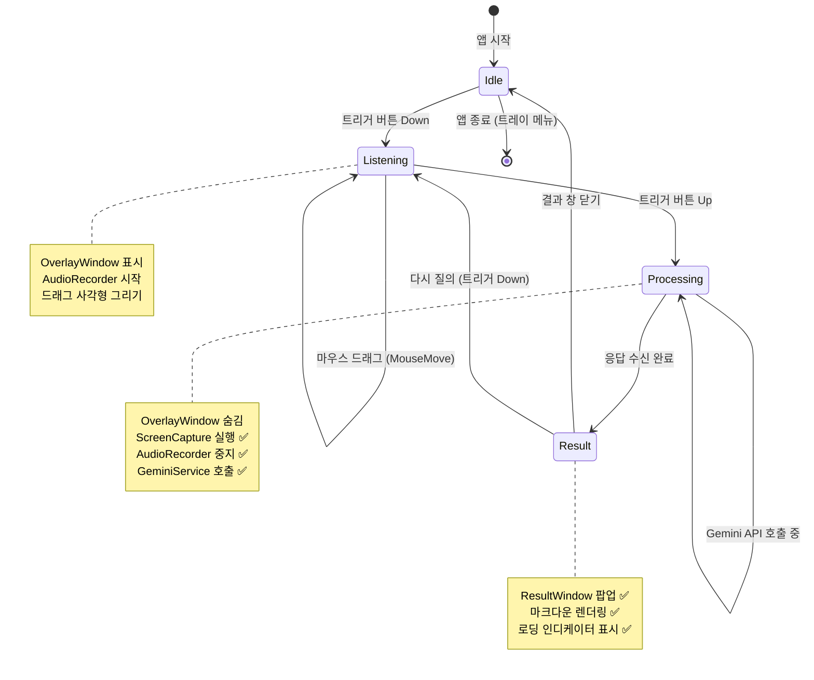

# 🏗️ AI Mouse: System Architecture & Logic Flow

이 문서는 AI Mouse 프로젝트의 **정적 구조(Static Structure)**와 **동적 데이터 흐름(Dynamic Flow)**을 설명합니다.

---

## 1. 🔄 Core Logic Flow (핵심 시퀀스)

### 1.1. 드래그+음성 질의 (Core User Flow)
사용자가 트리거 버튼을 누르고 드래그하며 질문하는 전체 흐름입니다. **단방향 데이터 흐름(Uni-directional Data Flow)**을 지향합니다.



### 1.2. 앱 시작 및 트레이 상주 (Startup Flow)
앱이 실행되어 백그라운드에 상주하는 초기화 과정입니다.



---

## 2. 🏛️ Architecture Layers (아키텍처 계층)

### 2.1. MVVM 계층 구조



### 2.2. 의존성 주입 구조 (DI Container) ✅ 구현 완료

**App.xaml.cs**에서 `ServiceCollection`을 구성합니다:

```csharp
// ViewModel (Transient)
services.AddTransient<MainViewModel>();
services.AddTransient<OverlayViewModel>();
services.AddTransient<ResultViewModel>();

// View (Transient - 필요 시 생성)
services.AddTransient<MainWindow>();
services.AddTransient<OverlayWindow>();
services.AddTransient<ResultWindow>();

// ServiceProvider 빌드
var serviceProvider = services.BuildServiceProvider();

// MainWindow 생성 및 DataContext 주입
var mainWindow = serviceProvider.GetRequiredService<MainWindow>();
mainWindow.DataContext = serviceProvider.GetRequiredService<MainViewModel>();
mainWindow.Hide(); // 초기 상태를 숨김으로 유지

// TaskbarIcon 설정 및 검증 메시지
_trayIcon = (TaskbarIcon)FindResource("TrayIcon");
_trayIcon.Icon = SystemIcons.Application; // 빈 아이콘 방지
MessageBox.Show("AI Mouse가 백그라운드에서 실행되었습니다.\n트레이 아이콘을 우클릭해보세요.", "실행 성공");
```

**현재 상태:**
- ✅ `Microsoft.Extensions.DependencyInjection` 패키지 설치 완료
- ✅ `App.xaml.cs`에서 `ServiceCollection` 구성 완료
- ✅ `MainViewModel`과 `MainWindow` DI 등록 완료
- ✅ `MainViewModel` 클래스 생성 완료 (`CommunityToolkit.Mvvm` 사용)
- ✅ 시스템 트레이 아이콘 구현 완료 (`TaskbarIcon` 리소스)
- ✅ UX 피드백 구현 완료 (`MessageBox` 검증 메시지, `Settings_Click`, `Exit_Click` 이벤트 핸들러)
- ✅ `IGlobalHookService` 싱글톤 등록 완료 (Phase 1.2)
- ✅ `GlobalHookService` 구현 완료 (Phase 1.2)
- ✅ 전역 마우스 훅 시작 로직 구현 완료 (Phase 1.2)
- ✅ `OverlayViewModel` 및 `OverlayWindow` DI 등록 완료 (Phase 1.3)
- ✅ 투명 오버레이 윈도우 구현 완료 (Phase 1.3)
- ✅ 드래그 사각형 시각화 구현 완료 (Phase 1.3)
- ✅ `MainViewModel`에서 마우스 이벤트 구독 및 오버레이 제어 완료 (Phase 1.3)
- ✅ `IScreenCaptureService` 및 `ScreenCaptureService` 구현 완료 (Phase 2.1)
- ✅ `DpiHelper` 유틸리티 구현 완료 (Phase 2.1)
- ✅ 화면 캡처 및 클립보드 복사 기능 구현 완료 (Phase 2.1)
- ✅ `IAudioRecorderService` 및 `AudioRecorderService` 구현 완료 (Phase 2.2)
- ✅ NAudio 패키지 설치 완료 (Phase 2.2)
- ✅ 마이크 음성 녹음 및 WAV 파일 저장 기능 구현 완료 (Phase 2.2)
- ✅ `IGeminiService` 및 `GeminiService` 구현 완료 (Phase 3.1)
- ✅ Newtonsoft.Json 패키지 설치 완료 (Phase 3.1)
- ✅ HttpClient 기반 Gemini API 통신 기능 구현 완료 (Phase 3.1)
- ✅ Gemini 모델 ID를 `gemini-2.5-flash`로 변경 및 URL 동적 생성 로직 개선 완료 (16차)
- ✅ `ResultViewModel` 및 `ResultWindow` 구현 완료 (Phase 4.1)
- ✅ Markdig.Wpf 패키지 설치 완료 (Phase 4.1)
- ✅ 마크다운 렌더링 기능 구현 완료 (Phase 4.1)
- ✅ MessageBox 대신 ResultWindow 사용하도록 변경 완료 (Phase 4.1)
- ✅ ResultWindow 드래그 이동 기능 구현 완료 (DragMove, 17차)
- ✅ ResultWindow 스크롤 UX 개선 완료 (MaxHeight 900, 픽셀 단위 스크롤, 17차)
- ✅ ResultWindow UX 개선 완료 (항상 위 해제, 최소화 버튼, 스크롤 포커스 수정, 18차)
- ✅ ResultWindow 스크롤 포커스 문제 해결 완료 (PreviewMouseWheel 이벤트 터널링, 19차)
- ✅ `SettingsViewModel` 및 `SettingsWindow` 구현 완료 (Phase 4.2)
- ✅ 트리거 버튼 동적 변경 기능 구현 완료 (Phase 4.2)
- ✅ API Key 설정 및 임시 폴더 열기 기능 구현 완료 (Phase 4.2)
- ✅ `Logger` 유틸리티 구현 완료 (Phase 4.3)
- ✅ 파일 로깅 시스템 구현 완료 (Phase 4.3)
- ✅ 전역 예외 처리 구현 완료 (Phase 4.3)
- ✅ `GlobalHookService` 예외 처리 안전장치 추가 완료 (Phase 4.3)

---

## 3. 🚦 State Machine (상태 전이)

`MainViewModel`은 앱의 상태 기계(State Machine) 역할을 합니다.



**상태별 주요 동작:**

| 상태 | 주요 동작 | UI 표시 |
|:---:|:---|:---|
| **Idle** | 트리거 대기, Hook 활성화 | 트레이 아이콘만 표시 |
| **Listening** | 오버레이 표시, 녹음 시작, 드래그 영역 추적 | 반투명 오버레이 + 사각형 |
| **Processing** | 캡처/녹음 완료, API 전송 중 | 트레이 아이콘 (로딩 애니메이션) |
| **Result** | 응답 표시 | ResultWindow 팝업 |

---

## 4. 🔌 Service Interfaces (서비스 인터페이스)

### 4.1. IGlobalHookService ✅ 구현 완료
전역 마우스/키보드 이벤트를 감지합니다.

```csharp
public interface IGlobalHookService : IDisposable
{
    event EventHandler<MouseActionEventArgs>? MouseAction;
    
    TriggerButton CurrentTrigger { get; set; } // ✅ Phase 4.2 추가
    
    void Start();
    void Stop();
    bool IsActive { get; }
}
```

**구현 세부사항:**
- `SetWindowsHookEx(WH_MOUSE_LL)` 사용 ✅
- `LowLevelMouseProc` 콜백에서 이벤트 필터링 ✅
- **경량화:** 콜백은 즉시 리턴하고, 이벤트는 `Task.Run`으로 비동기 전파 ✅
- `MouseActionEventArgs`에 액션 타입(Move/Down/Up), 좌표, 버튼 정보 포함 ✅
- `NativeMethods.cs`에 Win32 API P/Invoke 선언 완료 ✅
- `Dispose()` 패턴으로 훅 해제 보장 ✅
- **트리거 동적 변경:** `CurrentTrigger` 속성으로 런타임에 트리거 버튼 변경 가능 ✅ (Phase 4.2)
- **기본 동작 차단:** 트리거 버튼의 Down/Up 이벤트 감지 시 `return 1`로 이벤트 전파 차단 ✅ (Phase 4.2)
- **예외 처리 안전장치:** `HookCallback` 내부 모든 예외를 `try-catch`로 감싸고 `Logger.Error`로 기록 ✅ (Phase 4.3)

### 4.2. IScreenCaptureService ✅ 구현 완료
지정된 화면 영역을 이미지로 캡처합니다.

```csharp
public interface IScreenCaptureService
{
    Task<BitmapSource> CaptureRegionAsync(Rect region);
    Task CopyToClipboardAsync(BitmapSource image);
}
```

**구현 세부사항:**
- GDI+ (`Graphics.CopyFromScreen`) 사용 ✅
- 물리 좌표계 사용 (마우스 훅이 물리 좌표 제공) ✅
- `System.Drawing.Bitmap` → WPF `BitmapSource` 변환 ✅
- `System.Drawing.Common` 패키지 사용 ✅
- 리소스 안전 관리 (`using` 문으로 자동 해제) ✅

### 4.3. IAudioRecorderService ✅ 구현 완료
마이크 입력을 WAV 파일로 녹음합니다.

```csharp
public interface IAudioRecorderService : IDisposable
{
    void StartRecording();
    Task<string> StopRecordingAsync(); // WAV 파일 경로 반환
}
```

**구현 세부사항:**
- NAudio (`WaveInEvent`) 사용 ✅
- PCM 16bit, Mono, 16kHz 포맷 (Gemini API 호환) ✅
- `Path.GetTempPath()/AI_Mouse/audio_temp.wav`에 저장 (덮어쓰기 모드) ✅
- `TaskCompletionSource`를 사용한 비동기 처리 ✅
- `WaveFileWriter` Dispose로 파일 잠금 해제 보장 ✅

### 4.4. IGeminiService ✅ 구현 완료
Google Gemini API와 통신합니다.

```csharp
public interface IGeminiService
{
    Task<string> GetResponseAsync(BitmapSource image, string audioPath, string apiKey);
}
```

**구현 세부사항:**
- `HttpClient` 사용 (Singleton) ✅
- 엔드포인트: `gemini-2.5-flash` 모델 사용 (상수로 관리, 환경에 따라 변경 가능) ✅
- 모델 ID 및 API 버전 상수 분리: `ModelId = "gemini-2.5-flash"`, `ApiVersion = "v1beta"` ✅
- URL 동적 생성: 상수를 사용하여 `https://generativelanguage.googleapis.com/{ApiVersion}/models/{ModelId}:generateContent?key={apiKey}` 형식으로 생성 ✅
- 디버그 로그 강화: 요청 시작 시 사용 중인 모델 ID를 로그에 출력 ✅
- 멀티모달 입력 (이미지 + 오디오) ✅
- 이미지: `BitmapSource` → JPEG Encoder → Byte[] → Base64 변환 ✅
- 오디오: 파일 경로에서 Byte[] 읽기 → Base64 변환 ✅
- JSON 구조: `contents[0].parts[]` 배열 형식 (텍스트 + 이미지 + 오디오) ✅
- 비동기 처리 및 예외 처리 (`HttpRequestException` 처리) ✅
- DTO 클래스: `GeminiService` 내부에 `private class`로 정의 ✅

---

## 5. 💾 Data Flow (데이터 흐름)

### 5.1. 캡처 데이터 흐름

```
사용자 드래그 영역 (물리 좌표 - Physical Coordinates)
    ↓
MainViewModel.HandleMouseUp (물리 Rect 계산)
    ↓
ScreenCaptureService.CaptureRegionAsync(Rect) ✅
    ↓
GDI+ Bitmap 생성 (Graphics.CopyFromScreen) ✅
    ↓
BitmapSource 변환 (WPF 호환) ✅
    ↓
Clipboard.SetImage (클립보드 복사) ✅
    ↓
GeminiService.GetResponseAsync(image, audioPath, apiKey) ✅
    ↓
HttpClient.PostAsync (Gemini 2.5 Flash API) ✅
    ↓
응답 텍스트 반환 ✅
```

### 5.2. 오디오 데이터 흐름

```
마이크 입력 (WaveInEvent) ✅
    ↓
AudioRecorderService.StartRecording() ✅
    ↓
NAudio 버퍼 수집 (PCM 16bit, Mono, 16kHz) ✅
    ↓
AudioRecorderService.StopRecordingAsync() ✅
    ↓
WAV 파일로 저장 (Path.GetTempPath()/AI_Mouse/audio_temp.wav) ✅
    ↓
파일 경로 반환 ✅
    ↓
GeminiService.GetResponseAsync(image, audioPath, apiKey) ✅
    ↓
Base64 인코딩 (이미지 + 오디오) ✅
    ↓
JSON 요청 본문 생성 ✅
    ↓
HttpClient.PostAsync (Gemini 2.5 Flash API) ✅
```

---

## 6. 🛡️ Resource Management (리소스 관리)

### 6.1. IDisposable 패턴

다음 서비스들은 `IDisposable`을 구현하여 리소스를 안전하게 해제합니다:

- **GlobalHookService:** `UnhookWindowsHookEx` 호출 ✅
- **AudioRecorderService:** `WaveInEvent.Dispose()`, `WaveFileWriter.Dispose()` ✅
- **ScreenCaptureService:** `Bitmap.Dispose()`, `Graphics.Dispose()` ✅

**App.xaml.cs**에서 앱 종료 시:

```csharp
protected override void OnExit(ExitEventArgs e)
{
    try
    {
        // GlobalHookService 중지 (훅 해제)
        var hookService = _serviceProvider?.GetService<IGlobalHookService>();
        hookService?.Stop();
        
        // ServiceProvider가 IDisposable이면 Dispose 호출
        if (_serviceProvider is IDisposable disposable)
        {
            disposable.Dispose();
        }
        
        // 트레이 아이콘 정리
        _trayIcon?.Dispose();
        
        // 앱 종료 로그 기록
        Logger.Info("앱 종료됨");
    }
    catch (Exception ex)
    {
        Logger.Error("종료 처리 중 오류", ex);
    }
    
    base.OnExit(e);
}
```

**전역 예외 처리:**
- `DispatcherUnhandledException`: WPF 디스패처 예외 처리 (가능하면 앱 유지) ✅ (Phase 4.3)
- `AppDomain.CurrentDomain.UnhandledException`: AppDomain 예외 처리 (복구 불가) ✅ (Phase 4.3)

### 6.2. 메모리 누수 방지

- **Hook 콜백 경량화:** 무거운 작업은 `Task.Run`으로 분리
- **이미지 처리:** `using` 문으로 `Bitmap` 자동 해제
- **이벤트 구독 해제:** ViewModel Dispose 시 이벤트 핸들러 제거

---

## 7. 🔐 Security & Configuration (보안 및 설정)

### 7.1. API Key 관리 ✅ 구현 완료

- **저장 위치:** 외부 파일 `apikey.txt` (실행 파일과 같은 폴더) ✅
- **보안:** `.gitignore`에 `apikey.txt` 추가하여 Git 커밋 방지 ✅
- **로드 방식:** `MainViewModel.LoadApiKey()` 메서드로 런타임에 파일에서 로드 ✅
- **파일 경로:** `AppDomain.CurrentDomain.BaseDirectory/apikey.txt` ✅
- **빌드 설정:** `AI_Mouse.csproj`에 `CopyToOutputDirectory="PreserveNewest"` 설정으로 출력 디렉토리로 자동 복사 ✅
- **예외 처리:** 파일 읽기 실패 시 `null` 반환 및 사용자 안내 메시지 표시 ✅
- **전송:** HTTPS로만 전송 (SDK 내장)
- **설정 창:** `SettingsWindow`에서 API Key 입력 및 저장 가능 ✅ (Phase 4.2)

### 7.2. DPI Awareness ✅ 구현 완료

- **Manifest:** `app.manifest`에 `<dpiAwareness>PerMonitorV2</dpiAwareness>` 설정
- **좌표 변환:** `DpiHelper` 유틸리티로 멀티 모니터 환경 좌표 보정 ✅
- **구현 내용:**
  - `Helpers/DpiHelper.cs` 생성 완료 ✅
  - Win32 API (`GetDpiForMonitor`, `MonitorFromPoint`) P/Invoke 선언 추가 ✅
  - 물리 좌표 ↔ 논리 좌표 변환 메서드 구현 ✅
  - `PhysicalToLogicalRect` 메서드로 WPF OverlayWindow에 사용할 논리 좌표 변환 ✅
  - `MainViewModel`의 `HandleMouseMove`에서 DPI 변환 적용 ✅
  - 네임스페이스 별칭 적용으로 타입 모호성 해결 ✅ (`WpfPoint`, `WinPoint`, `WpfRect`)

---

## 8. 📊 Component Responsibilities (컴포넌트 책임)

| 컴포넌트 | 주요 책임 | 의존성 |
|:---|:---|:---|
| **App.xaml.cs** | DI 컨테이너 구성, 앱 생명주기 관리 | ServiceCollection |
| **MainViewModel** | 상태 관리, 이벤트 조율, 커맨드 처리 | 모든 Service |
| **OverlayViewModel** | 드래그 사각형 좌표 계산 | 없음 (순수 계산) |
| **GlobalHookService** | Win32 Hook 관리, 이벤트 전파 | NativeMethods |
| **ScreenCaptureService** | 화면 캡처, 이미지 변환 | NativeMethods, DpiHelper |
| **AudioRecorderService** | 오디오 녹음, WAV 저장 | NAudio ✅ |
| **GeminiService** | API 통신, 응답 파싱 | Google.GenerativeAI |
| **ResultWindow** | 마크다운 렌더링, UI 표시, 드래그 이동, 스크롤, 최소화, 포커스 관리, 휠 이벤트 터널링 | Markdig.Wpf ✅ |
| **ResultViewModel** | 응답 텍스트 및 로딩 상태 관리 | 없음 (순수 상태) |
| **SettingsWindow** | 설정 UI 표시, API Key 입력, 트리거 버튼 선택, 임시 폴더 열기 | 없음 (순수 UI) ✅ (Phase 4.2) |
| **SettingsViewModel** | 설정 상태 관리, API Key 저장, 트리거 버튼 변경 | IGlobalHookService ✅ (Phase 4.2) |
| **Logger** | 파일 로깅, 예외 기록, 앱 생명주기 추적 | 없음 (순수 유틸리티) ✅ (Phase 4.3) |

---

## 9. 🚀 Extension Points (확장 포인트)

향후 기능 추가를 위한 확장 가능한 구조:

1. **다른 AI 서비스 지원:** `IGeminiService`를 `IAIService`로 추상화
2. **플러그인 시스템:** `Services/Plugins/` 폴더에 확장 서비스 추가
3. **설정 저장:** `ISettingsService` 인터페이스로 다양한 저장소 지원
4. **다국어 지원:** 리소스 파일 및 `ILocalizationService` 추가

---

**Last Updated:** 2026-02-05  
**Version:** 2.7 (Phase 4.3 완료: 파일 로깅 시스템 및 전역 예외 처리 구현)
