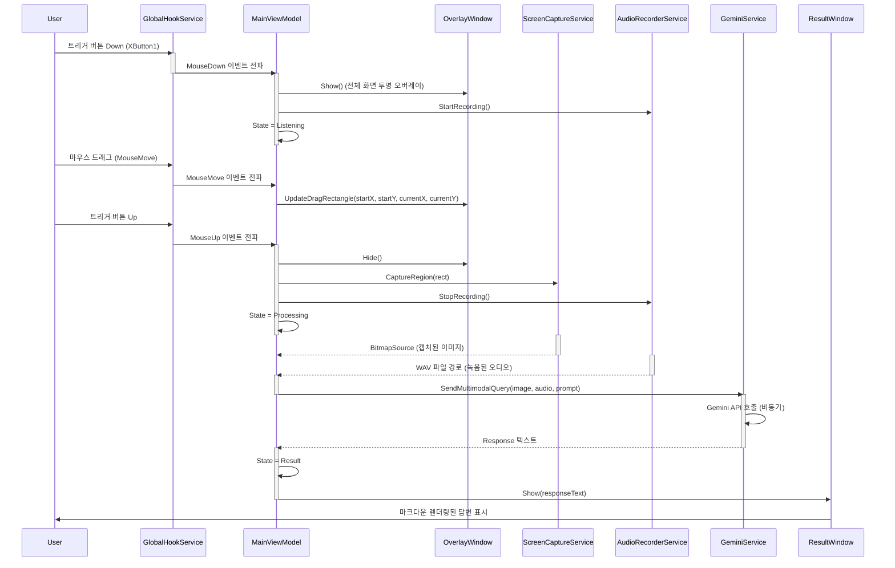
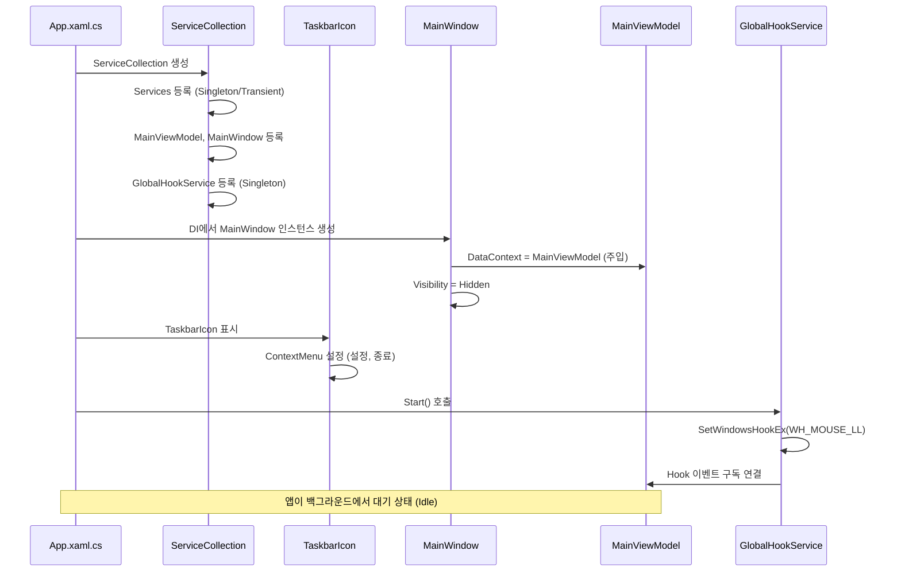
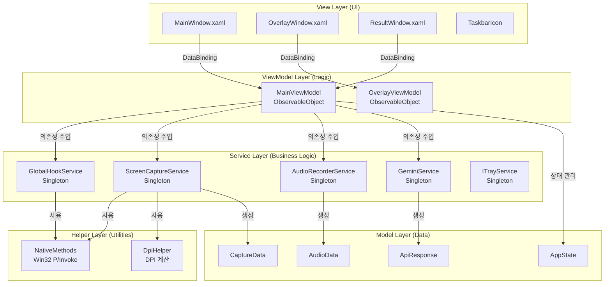
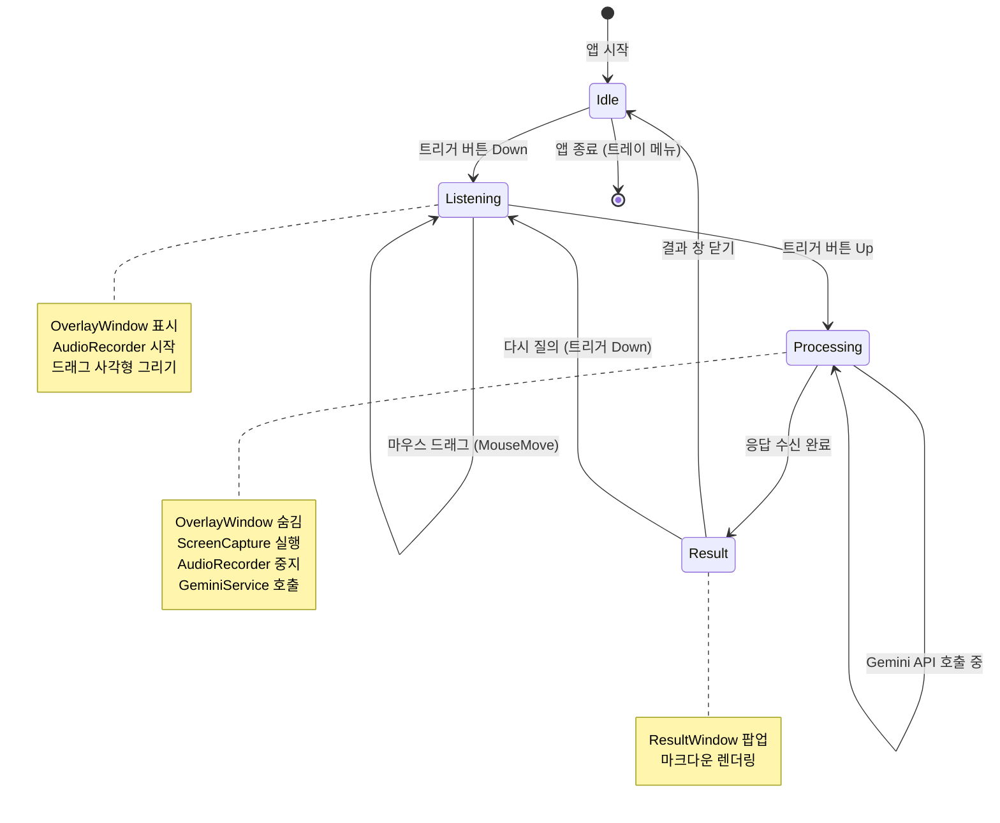

# 🏗️ AI Mouse: System Architecture & Logic Flow

이 문서는 AI Mouse 프로젝트의 **정적 구조(Static Structure)**와 **동적 데이터 흐름(Dynamic Flow)**을 설명합니다.

---

## 1. 🔄 Core Logic Flow (핵심 시퀀스)

### 1.1. 드래그+음성 질의 (Core User Flow)
사용자가 트리거 버튼을 누르고 드래그하며 질문하는 전체 흐름입니다. **단방향 데이터 흐름(Uni-directional Data Flow)**을 지향합니다.



### 1.2. 앱 시작 및 트레이 상주 (Startup Flow)
앱이 실행되어 백그라운드에 상주하는 초기화 과정입니다.



---

## 2. 🏛️ Architecture Layers (아키텍처 계층)

### 2.1. MVVM 계층 구조



### 2.2. 의존성 주입 구조 (DI Container)

**App.xaml.cs**에서 `ServiceCollection`을 구성합니다:

```csharp
// Singleton 서비스 (앱 생명주기 동안 단일 인스턴스)
services.AddSingleton<IGlobalHookService, GlobalHookService>();
services.AddSingleton<IScreenCaptureService, ScreenCaptureService>();
services.AddSingleton<IAudioRecorderService, AudioRecorderService>();
services.AddSingleton<IGeminiService, GeminiService>();
services.AddSingleton<ITrayService, TrayService>();

// ViewModel (Transient 또는 Singleton - 선택 가능)
services.AddTransient<MainViewModel>();
services.AddTransient<OverlayViewModel>();

// View (Transient - 필요 시 생성)
services.AddTransient<MainWindow>();
services.AddTransient<OverlayWindow>();
services.AddTransient<ResultWindow>();
```

---

## 3. 🚦 State Machine (상태 전이)

`MainViewModel`은 앱의 상태 기계(State Machine) 역할을 합니다.



**상태별 주요 동작:**

| 상태 | 주요 동작 | UI 표시 |
|:---:|:---|:---|
| **Idle** | 트리거 대기, Hook 활성화 | 트레이 아이콘만 표시 |
| **Listening** | 오버레이 표시, 녹음 시작, 드래그 영역 추적 | 반투명 오버레이 + 사각형 |
| **Processing** | 캡처/녹음 완료, API 전송 중 | 트레이 아이콘 (로딩 애니메이션) |
| **Result** | 응답 표시 | ResultWindow 팝업 |

---

## 4. 🔌 Service Interfaces (서비스 인터페이스)

### 4.1. IGlobalHookService
전역 마우스/키보드 이벤트를 감지합니다.

```csharp
public interface IGlobalHookService : IDisposable
{
    event EventHandler<MouseEventArgs>? MouseDown;
    event EventHandler<MouseEventArgs>? MouseUp;
    event EventHandler<MouseEventArgs>? MouseMove;
    
    void Start();
    void Stop();
    bool IsActive { get; }
}
```

**구현 세부사항:**
- `SetWindowsHookEx(WH_MOUSE_LL)` 사용
- `LowLevelMouseProc` 콜백에서 이벤트 필터링
- **경량화:** 콜백은 즉시 리턴하고, 이벤트는 `Task.Run`으로 비동기 전파

### 4.2. IScreenCaptureService
지정된 화면 영역을 이미지로 캡처합니다.

```csharp
public interface IScreenCaptureService
{
    Task<BitmapSource> CaptureRegionAsync(Rect region);
    Task SaveToClipboardAsync(BitmapSource image);
    Task<string> SaveToFileAsync(BitmapSource image, string path);
}
```

**구현 세부사항:**
- GDI+ (`Graphics.CopyFromScreen`) 사용
- Per-Monitor DPI Awareness 적용 (좌표 보정)
- `BitmapSource`로 변환하여 WPF UI 호환

### 4.3. IAudioRecorderService
마이크 입력을 WAV 파일로 녹음합니다.

```csharp
public interface IAudioRecorderService : IDisposable
{
    event EventHandler<AudioLevelEventArgs>? AudioLevelChanged;
    
    void StartRecording();
    Task<string> StopRecordingAsync(); // WAV 파일 경로 반환
    bool IsRecording { get; }
}
```

**구현 세부사항:**
- NAudio (`WaveInEvent`) 사용
- PCM 16bit, Mono, 16kHz/24kHz 포맷
- 임시 폴더에 저장 후 정리 로직

### 4.4. IGeminiService
Google Gemini API와 통신합니다.

```csharp
public interface IGeminiService
{
    Task<string> SendMultimodalQueryAsync(
        BitmapSource image, 
        string audioFilePath, 
        string? userPrompt = null);
    
    void SetApiKey(string apiKey);
    bool IsConfigured { get; }
}
```

**구현 세부사항:**
- Google.GenerativeAI SDK 사용
- 멀티모달 입력 (이미지 + 오디오)
- 비동기 처리 및 예외 처리 (재시도 로직)

---

## 5. 💾 Data Flow (데이터 흐름)

### 5.1. 캡처 데이터 흐름

```
사용자 드래그 영역 (Screen Coordinates)
    ↓
OverlayWindow에서 Rect 계산
    ↓
MainViewModel.CaptureRegion (Rect)
    ↓
ScreenCaptureService.CaptureRegionAsync(Rect)
    ↓
GDI+ Bitmap 생성
    ↓
BitmapSource 변환 (WPF 호환)
    ↓
MemoryStream (API 전송용)
    ↓
GeminiService.SendMultimodalQueryAsync(image, audio, prompt)
```

### 5.2. 오디오 데이터 흐름

```
마이크 입력 (WaveInEvent)
    ↓
AudioRecorderService.StartRecording()
    ↓
NAudio 버퍼 수집 (PCM)
    ↓
AudioRecorderService.StopRecordingAsync()
    ↓
WAV 파일로 저장 (임시 폴더)
    ↓
파일 경로 반환
    ↓
GeminiService.SendMultimodalQueryAsync(image, audioPath, prompt)
```

---

## 6. 🛡️ Resource Management (리소스 관리)

### 6.1. IDisposable 패턴

다음 서비스들은 `IDisposable`을 구현하여 리소스를 안전하게 해제합니다:

- **GlobalHookService:** `UnhookWindowsHookEx` 호출
- **AudioRecorderService:** `WaveInEvent.Dispose()`
- **ScreenCaptureService:** `Bitmap.Dispose()`, `Graphics.Dispose()`

**App.xaml.cs**에서 앱 종료 시:

```csharp
protected override void OnExit(ExitEventArgs e)
{
    // ServiceProvider에서 모든 IDisposable 서비스 해제
    _serviceProvider?.Dispose();
    base.OnExit(e);
}
```

### 6.2. 메모리 누수 방지

- **Hook 콜백 경량화:** 무거운 작업은 `Task.Run`으로 분리
- **이미지 처리:** `using` 문으로 `Bitmap` 자동 해제
- **이벤트 구독 해제:** ViewModel Dispose 시 이벤트 핸들러 제거

---

## 7. 🔐 Security & Configuration (보안 및 설정)

### 7.1. API Key 관리

- **저장 위치:** Windows Credential Manager 또는 암호화된 로컬 파일
- **입력:** Settings 창에서 사용자 입력
- **전송:** HTTPS로만 전송 (SDK 내장)

### 7.2. DPI Awareness

- **Manifest:** `app.manifest`에 `<dpiAwareness>PerMonitorV2</dpiAwareness>` 설정
- **좌표 변환:** `DpiHelper` 유틸리티로 멀티 모니터 환경 좌표 보정

---

## 8. 📊 Component Responsibilities (컴포넌트 책임)

| 컴포넌트 | 주요 책임 | 의존성 |
|:---|:---|:---|
| **App.xaml.cs** | DI 컨테이너 구성, 앱 생명주기 관리 | ServiceCollection |
| **MainViewModel** | 상태 관리, 이벤트 조율, 커맨드 처리 | 모든 Service |
| **OverlayViewModel** | 드래그 사각형 좌표 계산 | 없음 (순수 계산) |
| **GlobalHookService** | Win32 Hook 관리, 이벤트 전파 | NativeMethods |
| **ScreenCaptureService** | 화면 캡처, 이미지 변환 | NativeMethods, DpiHelper |
| **AudioRecorderService** | 오디오 녹음, WAV 저장 | NAudio |
| **GeminiService** | API 통신, 응답 파싱 | Google.GenerativeAI |
| **ResultWindow** | 마크다운 렌더링, UI 표시 | Markdig.Wpf |

---

## 9. 🚀 Extension Points (확장 포인트)

향후 기능 추가를 위한 확장 가능한 구조:

1. **다른 AI 서비스 지원:** `IGeminiService`를 `IAIService`로 추상화
2. **플러그인 시스템:** `Services/Plugins/` 폴더에 확장 서비스 추가
3. **설정 저장:** `ISettingsService` 인터페이스로 다양한 저장소 지원
4. **다국어 지원:** 리소스 파일 및 `ILocalizationService` 추가

---

**Last Updated:** 2026-02-05  
**Version:** 1.0 (Phase 1.1 기준)
