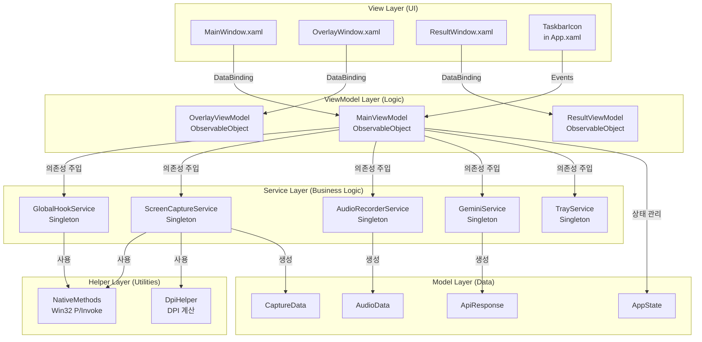
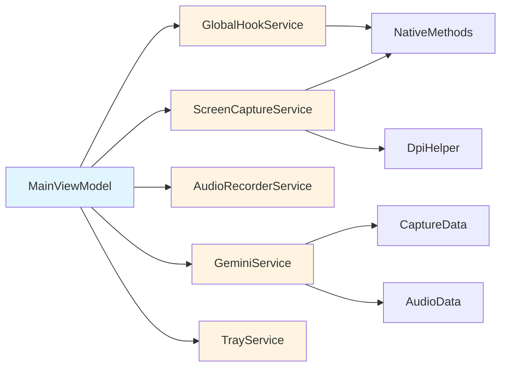

# 🌳 AI Mouse: Project Tree Structure

이 문서는 AI Mouse 프로젝트의 **파일 시스템 구조(Directory)**와 **MVVM 계층 구조(Hierarchy)**를 시각화한 것입니다.

---

## 1. 📂 File Directory Structure (파일 시스템 구조)

### 프로젝트 루트 구조

```text
AI_Mouse/
├── App.xaml.cs                    # [Entry] 앱 시작점 (DI 컨테이너 구성 완료 ✅)
├── App.xaml                       # 애플리케이션 리소스 정의
├── AI_Mouse.csproj                # 프로젝트 파일 (.NET 8 WPF)
├── AI_Mouse.sln                   # 솔루션 파일
│
├── Views/                         # [UI] XAML 및 Code-behind ✅ 생성됨
│   ├── MainWindow.xaml           # 메인 윈도우 (초기엔 Hidden 예정)
│   └── MainWindow.xaml.cs        # MainWindow Code-behind
│   │
│   └── [Phase 1.3 예정]
│       ├── OverlayWindow.xaml        # 화면 캡처 오버레이
│       └── OverlayWindow.xaml.cs     # OverlayWindow Code-behind
│   │
│   └── [Phase 4.1 예정]
│       ├── ResultWindow.xaml         # AI 응답 표시 창
│       └── ResultWindow.xaml.cs      # ResultWindow Code-behind
│   │
│   └── [Phase 4.2 예정]
│       ├── SettingsWindow.xaml       # 설정 창
│       └── SettingsWindow.xaml.cs   # SettingsWindow Code-behind
│
├── ViewModels/                    # [Logic] View와 데이터 바인딩 ✅ 생성됨
│   ├── MainViewModel.cs           # 메인 로직 및 커맨드 처리 ✅ 생성됨
│   │
│   └── [Phase 1.3 예정]
│       └── OverlayViewModel.cs       # 오버레이 상태 관리
│   │
│   └── [Phase 4.1 예정]
│       └── ResultViewModel.cs        # 결과 표시 로직
│   │
│   └── [Phase 4.2 예정]
│       └── SettingsViewModel.cs      # 설정 화면 로직
│
├── Services/                      # [Core] 비즈니스 로직 및 시스템 제어 ⏳ 생성 예정
│   ├── Interfaces/                # 서비스 인터페이스
│   │   ├── IGlobalHookService.cs          # [Phase 1.2] 전역 입력 감지
│   │   ├── IScreenCaptureService.cs       # [Phase 2.1] 화면 캡처
│   │   ├── IAudioRecorderService.cs       # [Phase 2.2] 음성 녹음
│   │   ├── IGeminiService.cs              # [Phase 3.1] Gemini API
│   │   └── ITrayService.cs                # 트레이 아이콘 관리
│   │
│   └── Implementations/           # 서비스 구현체
│       ├── GlobalHookService.cs            # [Phase 1.2] Win32 Hook 구현
│       ├── ScreenCaptureService.cs        # [Phase 2.1] GDI+ 캡처 구현
│       ├── AudioRecorderService.cs        # [Phase 2.2] NAudio 녹음 구현
│       ├── GeminiService.cs               # [Phase 3.1] API 클라이언트 구현
│       └── TrayService.cs                 # 트레이 아이콘 구현
│
├── Models/                        # [Data] 데이터 구조 (DTO) ⏳ 생성 예정
│   ├── AppState.cs                # 앱 상태 (Idle/Listening/Processing/Result)
│   ├── CaptureData.cs            # [Phase 2.1] 캡처 데이터 모델
│   ├── AudioData.cs               # [Phase 2.2] 오디오 데이터 모델
│   └── ApiResponse.cs             # [Phase 3.1] API 응답 모델
│
├── Helpers/                       # [Util] Win32 Interop, 컨버터 등 ⏳ 생성 예정
│   ├── NativeMethods.cs           # [Phase 1.2] Win32 P/Invoke 선언
│   ├── DpiHelper.cs               # [Phase 2.1] DPI 좌표 변환 유틸리티
│   └── Converters/                # WPF Value Converter
│       └── (필요 시 추가)
│
├── Resources/                     # 리소스 파일 ⏳ 생성 예정
│   ├── Icons/                     # 아이콘 파일 (.ico)
│   └── Images/                    # 이미지 파일
│
└── md/                            # 프로젝트 문서화 ✅ 생성됨
    ├── Architecture.md            # 시스템 아키텍처 설계
    ├── CURSOR_GUIDELINES.md       # AI 코딩 가이드라인
    ├── Dev_Roadmap.md             # 개발 로드맵
    ├── Tree.md                    # (본 문서) 프로젝트 구조도
    ├── work_process.md            # 작업 프로세스 정의
    ├── To_do.md                   # 할 일 목록
    ├── proposal.md                # 기획서
    └── error_log.md               # 에러 로그
```

---

## 2. 🏛️ MVVM Architecture Layers (MVVM 계층 구조)

### 2.1. 계층별 역할 및 의존성



### 2.2. App.xaml.cs 구조 (DI 컨테이너) ✅ 구현 완료

```text
App.xaml.cs (Bootstrapper)
│
├── OnStartup() ✅ 구현 완료
│   ├── ServiceCollection 생성 ✅
│   ├── Services 등록:
│   │   ├── Transient: MainViewModel ✅
│   │   └── Transient: MainWindow ✅
│   │   └── (추후 Phase 1.2에서 서비스 등록 예정)
│   │
│   ├── ServiceProvider 빌드 ✅
│   ├── MainWindow 인스턴스 생성 (DI) ✅
│   ├── MainWindow.DataContext = MainViewModel (주입) ✅
│   ├── MainWindow.Hide() 호출 ✅
│   └── TaskbarIcon 표시 ✅
│
└── OnExit() ✅ 구현 완료
    ├── TaskbarIcon.Dispose() ✅
    └── ServiceProvider.Dispose() (리소스 정리) ✅
```

---

## 3. 🔄 Runtime Component Flow (런타임 컴포넌트 흐름)

### 3.1. 앱 시작 시퀀스

```text
1. App.xaml.cs OnStartup() ✅
   │
   ├── 2. ServiceCollection 구성 ✅
   │   └── MainViewModel, MainWindow 등록 (Transient)
   │
   ├── 3. ServiceProvider 빌드 ✅
   │   └── DI 컨테이너 준비 완료
   │
   ├── 4. MainWindow 생성 (DI) ✅
   │   ├── MainViewModel 주입 ✅
   │   ├── DataContext 설정 ✅
   │   └── Hide() 호출로 숨김 처리 ✅
   │
   ├── 5. TaskbarIcon 표시 ✅
   │   └── 시스템 트레이에 아이콘 표시
   │
   └── 6. 앱이 백그라운드에서 대기 (Idle 상태) ✅
       └── (Phase 1.2에서 GlobalHookService 시작 예정)
```

### 3.2. 사용자 질의 시퀀스

```text
사용자: 트리거 버튼 Down
   │
   ├── GlobalHookService → MouseDown 이벤트 발생
   │
   ├── MainViewModel.MouseDown 핸들러
   │   ├── State = Listening
   │   ├── OverlayWindow.Show()
   │   └── AudioRecorderService.StartRecording()
   │
   ├── 사용자: 마우스 드래그
   │   └── GlobalHookService → MouseMove 이벤트
   │       └── OverlayViewModel.UpdateDragRectangle()
   │
   ├── 사용자: 트리거 버튼 Up
   │   └── GlobalHookService → MouseUp 이벤트
   │
   └── MainViewModel.MouseUp 핸들러
       ├── State = Processing
       ├── OverlayWindow.Hide()
       ├── ScreenCaptureService.CaptureRegionAsync()
       ├── AudioRecorderService.StopRecordingAsync()
       └── GeminiService.SendMultimodalQueryAsync()
           └── ResultWindow.Show(response)
```

---

## 4. 📦 Namespace Structure (네임스페이스 구조)

```csharp
namespace AI_Mouse
{
    // Entry Point
    public partial class App : Application { }
}

namespace AI_Mouse.Views
{
    public partial class MainWindow : Window { }
    public partial class OverlayWindow : Window { }
    public partial class ResultWindow : Window { }
    public partial class SettingsWindow : Window { }
}

namespace AI_Mouse.ViewModels
{
    public partial class MainViewModel : ObservableObject { }
    public partial class OverlayViewModel : ObservableObject { }
    public partial class ResultViewModel : ObservableObject { }
    public partial class SettingsViewModel : ObservableObject { }
}

namespace AI_Mouse.Services.Interfaces
{
    public interface IGlobalHookService : IDisposable { }
    public interface IScreenCaptureService { }
    public interface IAudioRecorderService : IDisposable { }
    public interface IGeminiService { }
    public interface ITrayService { }
}

namespace AI_Mouse.Services.Implementations
{
    public class GlobalHookService : IGlobalHookService { }
    public class ScreenCaptureService : IScreenCaptureService { }
    public class AudioRecorderService : IAudioRecorderService { }
    public class GeminiService : IGeminiService { }
    public class TrayService : ITrayService { }
}

namespace AI_Mouse.Models
{
    public enum AppState { Idle, Listening, Processing, Result }
    public class CaptureData { }
    public class AudioData { }
    public class ApiResponse { }
}

namespace AI_Mouse.Helpers
{
    public static class NativeMethods { }
    public static class DpiHelper { }
}
```

---

## 5. 🔌 Service Dependencies (서비스 의존성)

### 5.1. 서비스 간 의존성 그래프



### 5.2. 서비스 생명주기

| 서비스 | 생명주기 | 초기화 시점 | 해제 시점 |
|:---|:---|:---|:---|
| **GlobalHookService** | Singleton | App 시작 시 | App 종료 시 (`IDisposable`) |
| **ScreenCaptureService** | Singleton | App 시작 시 | App 종료 시 |
| **AudioRecorderService** | Singleton | App 시작 시 | App 종료 시 (`IDisposable`) |
| **GeminiService** | Singleton | App 시작 시 | App 종료 시 |
| **TrayService** | Singleton | App 시작 시 | App 종료 시 |
| **MainViewModel** | Transient | MainWindow 생성 시 | MainWindow 닫힐 때 |

---

## 6. 📋 File Naming Conventions (파일 명명 규칙)

### 6.1. 네이밍 규칙

| 계층 | 파일명 패턴 | 예시 |
|:---|:---|:---|
| **View** | `{Name}Window.xaml` | `MainWindow.xaml`, `OverlayWindow.xaml` |
| **ViewModel** | `{Name}ViewModel.cs` | `MainViewModel.cs`, `OverlayViewModel.cs` |
| **Service Interface** | `I{Name}Service.cs` | `IGlobalHookService.cs`, `IScreenCaptureService.cs` |
| **Service Implementation** | `{Name}Service.cs` | `GlobalHookService.cs`, `ScreenCaptureService.cs` |
| **Model** | `{Name}.cs` 또는 `{Name}Data.cs` | `AppState.cs`, `CaptureData.cs` |
| **Helper** | `{Name}Helper.cs` 또는 `{Name}Methods.cs` | `DpiHelper.cs`, `NativeMethods.cs` |

### 6.2. 폴더 구조 규칙

- **Views/**: 모든 XAML 파일 및 Code-behind
- **ViewModels/**: 모든 ViewModel 클래스
- **Services/Interfaces/**: 서비스 인터페이스만
- **Services/Implementations/**: 서비스 구현체만
- **Models/**: 데이터 모델 및 DTO
- **Helpers/**: 유틸리티 및 Interop 코드

---

## 7. 🔗 Key Relationships (주요 관계)

### 7.1. View ↔ ViewModel 관계

- **View**: XAML에서 `DataContext`로 ViewModel 바인딩
- **ViewModel**: `ObservableObject` 상속으로 PropertyChanged 이벤트 발생
- **Command**: `RelayCommand` 속성으로 UI 이벤트 처리

### 7.2. ViewModel ↔ Service 관계

- **의존성 주입**: 생성자에서 Service 인터페이스 주입
- **이벤트 구독**: Service의 이벤트를 ViewModel에서 구독
- **비동기 호출**: Service 메서드를 `async/await`로 호출

### 7.3. Service ↔ Helper 관계

- **정적 메서드**: Helper는 주로 `static` 메서드로 제공
- **P/Invoke**: `NativeMethods`는 Win32 API 호출 담당
- **유틸리티**: `DpiHelper`는 좌표 변환 등 유틸리티 기능

---

**Last Updated:** 2026-02-05  
**Version:** 1.2 (Phase 1.1 완료 - DI 컨테이너 구성 및 트레이 아이콘 구현 완료)
